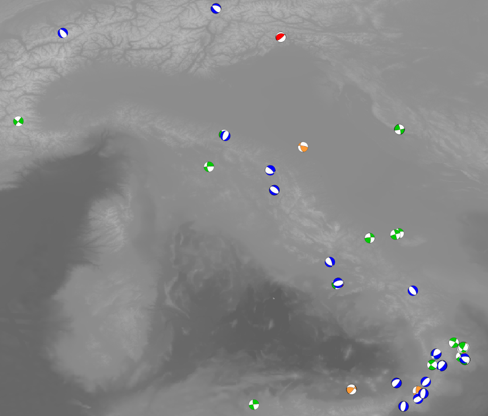

# beach_ball - a Qgis plugin

**beach_ball** is a Qgis plugin written in Python for representing focal mechanisms in map as beachballs.

Starting from the strike, dip, and rake values, it produces an SVG icon using the [Obspy ](https://docs.obspy.org/)module and links it to the features in your layer using the ID. **beach_ball** also calculates the kinematics according to the [Zobac (1992)](https://agupubs.onlinelibrary.wiley.com/doi/abs/10.1029/92JB00132) classification and displays the focal mechanism with different customisable colours.

The users can simply install the *beach_ball.zip* from the "manage and install plugins" in Qgis. This is the compressed version of the *beach_ball* folder.

*example* folder contains a small dataset of focal mechanism from [Time Domain Moment Tensor (Scognamiglio et al., 2006)](https://terremoti.ingv.it/tdmt) for performing a test of the plugin.

**beach_ball **is released under MIT licence.
